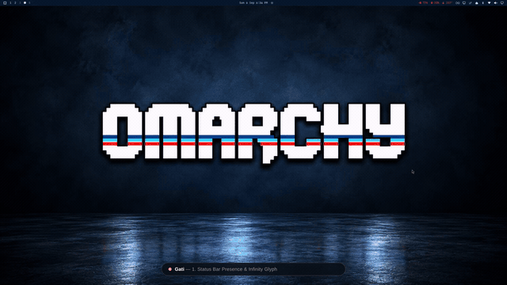

# Gati (गति) — Focus Timer for Omarchy Shell

<p align="center">
  
</p>

Gati (गति) is a beautiful and dynamic Sanskrit word. It comes from the root verb *gam*, which means "to go," "to move," or "to progress."

In the context of productivity and focus flow, Gati represents momentum, clarity, and purposeful movement.

Here is the deeper meaning behind why it fits so well:

- **Progress and Momentum:** Unlike static time, Gati implies forward motion. It is the steady, uninterrupted progress you make when you are deeply focused.
- **The Pace of Flow:** It refers to the speed, tempo, or pace of an action. In a focus session, Gati is that optimal working speed where you are neither rushing nor dragging—you are just in the zone.
- **Attainment of a Goal:** In philosophy, Gati also means reaching a destination, achieving a state, or gaining wisdom. Every focused block takes you one step closer to your final goal.

---

## 🖱️ Top Bar Quick Interactions

Gati lives directly in your Omarchy status bar as a sleek infinity glyph with live phase coloring and an optional countdown timer:

| Action | Interaction | Description |
| :--- | :--- | :--- |
| **Left Click** | `Toggle Panel` | Opens or closes the floating Popout Control Panel. |
| **Right Click** | `Quick Start / Pause` | Instantly starts or pauses the timer directly from the bar without opening the panel. |
| **Middle Click** | `Quick Reset` | Resets the active session and timer back to the start. |

---

## 🔄 Complete Workflow Lifecycle

1. **Top Bar Status & Indicator:**
   - Visual infinity glyph and optional countdown timer in the bar.
   - Dynamically shifts color between **Focus** (Pastel Coral `#f59999`) and **Break** (Pastel Mint `#99d9b7`).

2. **Focus Session (The Zen Rhythm Panel):**
   - Monospace countdown timer and embossed `FOCUS` subtitle.
   - **Harmonic Kinetic Waveform:** 28 dynamic bars oscillating with fluid harmonic frequencies in real time.
   - **Session Dots:** Minimalist floating dots track cycle progress (e.g. 4 focus sessions per cycle).
   - Control strip with **Reset**, **Play/Pause**, **Skip**, and **Settings** modal.

3. **Fullscreen Break Window Takeover:**
   - When the focus session finishes, Gati takes over with a distraction-free fullscreen overlay.
   - Features a **GPU-blurred desktop wallpaper backdrop** covered by a soft **0.65 opacity dark scrim**.
   - Displays break countdown, pastel mint harmonic wave, and quick action buttons (**`+5 min`**, **`Skip`**, and **Play/Pause**).

4. **Break Completion & Flow Continuity:**
   - When the break ends, the overlay displays **`00:00 BREAK COMPLETE`**.
   - The session dot lights up permanently as completed.
   - A prominent **`▶ Start Focus`** action pill lets you dive straight into the next focus session.

---

## ⌨️ IPC Interface & Automation

Control Gati headlessly or bind actions to your window manager keyboard shortcuts:

```bash
# Toggle between start and pause
omarchy-shell io.github.kanthi.gati toggle

# Start focus session
omarchy-shell io.github.kanthi.gati start

# Pause session
omarchy-shell io.github.kanthi.gati pause

# Reset current session
omarchy-shell io.github.kanthi.gati reset

# Skip to the next phase
omarchy-shell io.github.kanthi.gati skip

# Open or close the popout panel
omarchy-shell io.github.kanthi.gati open
omarchy-shell io.github.kanthi.gati close
```

---

## 🚀 Roadmap & Future Releases

The following features are planned for upcoming releases:

- ⌨️ **Global Desktop Keybindings:** Direct integration with Hyprland and Sway shortcuts for instant keyboard control.
- 🔔 **Acoustic Sound Cues & Chimes:** Elegant audio notifications (soft bells on focus start, soothing acoustic bowls on break start/finish).
- 📊 **Focus Statistics & Analytics:** Session history, daily streaks, completion charts, and time tracked per day/week.
- 🎵 **Ambient Soundscapes:** Built-in generative soundscapes (binaural beats, soft rain, coffee shop, white/pink noise).
- 🎨 **Expanded Theme Presets:** Customizable color palettes and font styling matching popular Omarchy themes.

---

## 📦 Installation & Setup

To install Gati into your local Omarchy shell plugins:

```bash
# 1. Clone the repository
git clone https://github.com/kanthi/omarchy-gati.git ~/Workspace/Repos/omarchy-gati

# 2. Link into your Omarchy plugins directory
mkdir -p ~/.config/omarchy/plugins/
ln -sfn ~/Workspace/Repos/omarchy-gati ~/.config/omarchy/plugins/io.github.kanthi.gati

# 3. Restart Omarchy Shell
omarchy-restart-shell
```
